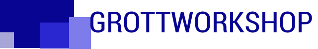

GWSCarbonBlade
---

GWSCarbonBlade is the demo app of the GWSCarbonBladeLibrary that brings most of the Material Lollipop api to
those applications below the api 21 level from api levle 15 to api level 19.

# Features

# Credits

Android Typeface Helper

Android SVG

Carbon